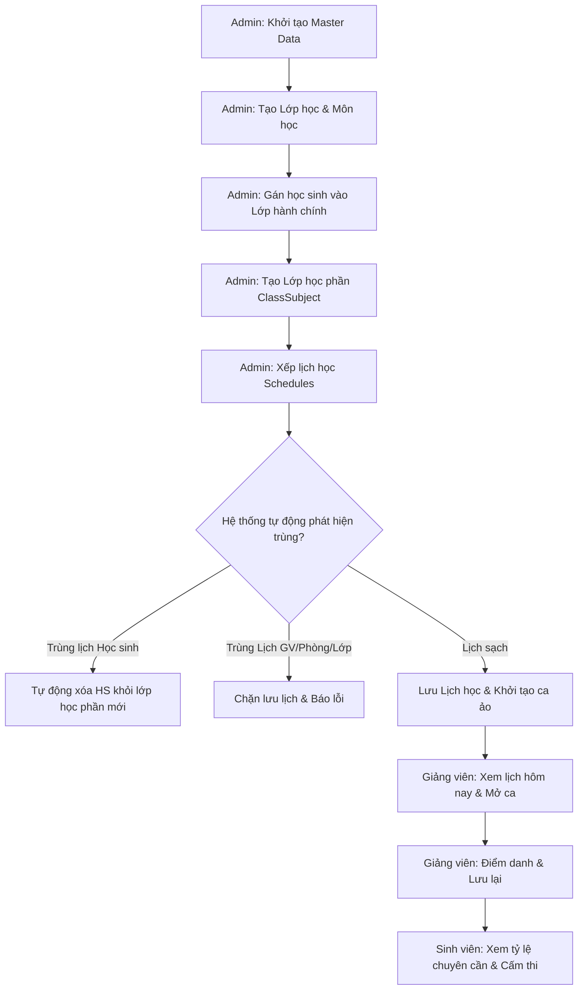

# 🎓 KỊCH BẢN DEMO HỆ THỐNG ĐIỂM DANH (TỪ A ĐẾN Z)
> **Tài liệu hướng dẫn báo cáo đồ án & demo các tính năng, ràng buộc nghiệp vụ thông minh cho Giảng viên chấm điểm.**

Tài liệu này cung cấp một kịch bản demo hoàn chỉnh, thiết kế dữ liệu mẫu và chỉ ra các "điểm đắt giá" (advanced logic) mà bạn nên làm bật lên trong buổi demo để thuyết phục hội đồng.

---

## 🗺️ Sơ Đồ Quy Trình Nghiệp Vụ Tổng Thể

---

## 💾 PHẦN 1: THIẾT LẬP DỮ LIỆU MẪU (MASTER DATA)
*Thực hiện bởi tài khoản **Admin** theo thứ tự từ trên xuống dưới để đảm bảo tính toàn vẹn dữ liệu.*

### Bước 1: Tạo Học Kỳ (Semesters)
* **Đường dẫn:** `Semesters` ➔ `Add Semester`
* **Dữ liệu demo khuyến nghị:**
  * **Tên:** `Summer 2026`
  * **Ngày bắt đầu (StartDate):** `01/05/2026`
  * **Ngày kết thúc (EndDate):** `30/08/2026`

### Bước 2: Tạo Môn Học (Subjects)
* **Đường dẫn:** `Subjects` ➔ `Add Subject`
* **Dữ liệu demo khuyến nghị:**
  | Mã Môn | Tên Môn Học | Số Tín Chỉ | Tổng Số Buổi |
  | :--- | :--- | :---: | :---: |
  | `PRN211` | C# Programming | 3 | 20 |
  | `PRM392` | Mobile App Development | 3 | 20 |

### Bước 3: Tạo Tài Khoản Giảng Viên & Sinh Viên
* **Tạo Giảng viên:** `Lecturers` ➔ `Create`
  * GV 1: `TUANVM` (tuanvm@fpt.edu.vn) — *Giảng viên chính*
  * GV 2: `Nguyễn Hoàng Nam` (namnh@fpt.edu.vn) — *Giảng viên dạy thay*
* **Tạo Sinh viên:** `Students` ➔ `Create` hoặc click **Import from Excel** để tải danh sách mẫu.
  * SV 1: `Học sinh A` (Mã số: `HE190001`)
  * SV 2: `Học sinh B` (Mã số: `HE190002`)

### Bước 4: Tạo Lớp Hành Chỉ & Gán Sinh Viên
1. **Tạo Lớp:** `Classes` ➔ `Add Class` ➔ Tạo 2 lớp: `SE1906` và `SE` (Software).
2. **Gán sinh viên chéo:** 
   * Tại lớp `SE1906`: Click **Students** ➔ Tick chọn **Học sinh A** và **Học sinh B** ➔ Lưu lại.
   * Tại lớp `SE` (Lớp học lại/học vượt): Click **Students** ➔ Chỉ tick chọn **Học sinh A** ➔ Lưu lại.

### Bước 5: Tạo Lớp Học Phần (ClassSubjects)
* **Đường dẫn:** `ClassSubjects` ➔ `Add New Assignment`
* **Gán 2 lớp học phần sau:**
  1. Lớp `SE1906` học môn `PRN211` (C#), kỳ `Summer 2026`, GV dạy: `TUANVM`.
  2. Lớp `SE` học môn `PRM392` (Mobile), kỳ `Summer 2026`, GV dạy: `Nguyễn Hoàng Nam`.

---

## 🎬 PHẦN 2: KỊCH BẢN DEMO CÁC TÍNH NĂNG ĐẮT GIÁ
*Vui lòng trình diễn tuần tự theo các phân cảnh sau để hội đồng chấm điểm thấy rõ các ràng buộc nghiệp vụ thông minh của dự án.*

### 🎭 Phân Cảnh 1: Sức mạnh chặn xung đột lịch học (Schedule & Student Overlap Block)
> [!IMPORTANT]
> **Điểm nhấn công nghệ:** Chặn trùng lịch 4 chiều (Giảng viên, Phòng, Lớp hành chính, và cá nhân Học sinh) + Tự động giải phóng sinh viên khỏi lớp xung đột.

#### Kịch bản 1: Thử nghiệm xếp trùng lịch (Chặn cứng Phòng / GV / Lớp)
1. Đăng nhập tài khoản **Admin**.
2. Vào `Schedules` ➔ `Add Schedule`.
3. Xếp lịch cho lớp học phần **SE1906 - C#**:
   * **Thứ:** `Monday`
   * **Khung giờ:** `16:00 - 17:00`
   * **Phòng:** `BE111`
   * Click **Save** ➔ Thành công.
4. Cố tình tạo thêm 1 lịch nữa cho lớp học phần khác học chung phòng `BE111` vào đúng `Monday` lúc `16:00 - 17:00`.
5. ➔ **Kết quả:** Hệ thống lập tức hiển thị cảnh báo đỏ nổi bật: *"Phòng học đã được xếp lịch trùng giờ trong ngày này."* và chặn không cho lưu. (Tương tự khi xếp trùng giờ cho cùng Giảng viên hoặc Lớp hành chính).

#### Kịch bản 2: Xếp lịch chéo gây trùng giờ cho Sinh viên chéo lớp (Tự động xóa học sinh)
1. Lớp học phần **SE1906 - C#** đã có lịch thứ 2 lúc `16:00 - 17:00` (Học sinh A nằm trong lớp này).
2. Tạo lịch học cho lớp học phần **SE - Mobile** (Lớp học lại có Học sinh A) vào đúng **thời gian trùng**:
   * **Thứ:** `Monday`
   * **Khung giờ:** `16:00 - 17:00` (Trùng giờ học lớp SE1906)
   * **Phòng:** `A3` (Phòng khác nên không bị chặn phòng)
3. Click **Save** ➔ Hệ thống lưu thành công lịch học.
4. **Kiểm tra chéo kết quả:** Admin click vào danh sách sinh viên của lớp **SE - Mobile**:
   ➔ **Kết quả:** **Học sinh A** đã tự động bị hệ thống loại bỏ khỏi danh sách của lớp **SE - Mobile** do có lịch học chéo bị trùng giờ với lớp chính khóa `SE1906`. 
   *(Giúp giải quyết triệt để trường hợp học sinh phân thân học 2 lớp cùng giờ).*

#### Kịch bản 3: Chặn cố tình gán chéo sinh viên trùng giờ học
1. Vào `Classes` ➔ Danh sách lớp `SE` ➔ Chọn **Students**.
2. Admin cố tình tick chọn lại **Học sinh A** để add vào lớp `SE` một lần nữa.
3. Click **Save** ➔ Hệ thống lập tức chặn lại và hiện thông báo chi tiết:
   > *"Trùng lịch: Sinh viên Học sinh A đã có lịch học trùng giờ ở lớp SE1906 (C# Programming)."*

---

### 🎭 Phân Cảnh 2: Nghiệp vụ Dạy thay phức tạp (Class Substitute Flow)
> [!TIP]
> **Điểm nhấn công nghệ:** Kiểm tra ràng buộc bận rộn của Giảng viên dạy thay theo nhiều chiều lịch dạy.

1. **Đăng nhập Admin:** Vào `ClassSubstitutes` ➔ Click `Add Substitute Assignment`.
2. Tạo lịch dạy thế cho lớp **SE1906 - C#** của GV `TUANVM` sang cho GV `Nguyễn Hoàng Nam`:
   * **Chọn ngày:** Chọn **Ngày hôm nay**.
   * Click **Save** ➔ Thành công.
3. **Thử nghiệm ràng buộc dạy thế:** Admin thử tạo thêm một lịch dạy thế chéo giờ khác cho giảng viên `Nguyễn Hoàng Nam` vào cùng khung giờ đó.
   ➔ **Kết quả:** Hệ thống chặn ngay lập tức và thông báo lỗi: *"Giảng viên dạy thay đã có lịch giảng dạy..."* hoặc *"Giảng viên dạy thay đã được phân công dạy thế cho lớp khác..."*
4. **Giảng viên dạy thế mở ca dạy:**
   * Đăng nhập tài khoản GV dạy thế `Nguyễn Hoàng Nam`.
   * Trên **Lecturer Dashboard**, ca học dạy thay của lớp **SE1906 - C#** lập tức hiển thị tại mục **Today's Classes** với trạng thái **"No session yet"**.

---

### 🎭 Phân Cảnh 3: Giao diện Tabular Day-Card & Mở ca điểm danh
> [!IMPORTANT]
> **Điểm nhấn công nghệ:** Giao diện gom nhóm ca học trong ngày trực quan theo dạng Bảng, tối ưu cho trường hợp một ngày có nhiều ca học. Xử lý đồng bộ múi giờ UTC+7.

1. **Giảng viên điểm danh:**
   * Giảng viên click nút **Open Session** của ca học.
   * Ca học chuyển sang trạng thái **Open**. Giảng viên click **Attend** để vào màn hình điểm danh.
   * Thực hiện tích chọn **Present (P - Có mặt)** hoặc **Absent (A - Vắng mặt)** cho từng sinh viên ➔ Nhấn **Save**.
2. **Cảnh báo cấm thi:**
   * Cho một sinh viên vắng mặt liên tiếp vượt quá 20% tổng số buổi học thiết lập của môn.
   * ➔ Hệ thống sẽ hiển thị biểu tượng cảnh báo cấm thi màu đỏ nổi bật `⚠️` ngay cạnh sinh viên đó.
3. **Admin quản lý ca học:**
   * Đăng nhập **Admin** ➔ Vào trang `Attendance Sessions`.
   * Màn hình sẽ hiển thị cấu trúc thẻ ngày (Day-Card) chứa bảng danh sách ca học cực kỳ gọn gàng.
   * Admin có thể quan sát đầy đủ tên Giảng viên chính/dạy thay của từng ca học và trạng thái tương ứng, hỗ trợ giám sát toàn bộ hoạt động trong ngày một cách dễ dàng.
   * Admin bấm **Close** để khóa ca học. Các sinh viên chưa được điểm danh sẽ tự động được hệ thống đánh dấu là **Absent (Vắng mặt)** kèm ghi chú rõ ràng.

---

### 🎭 Phân Cảnh 4: Xóa Lịch học & Đồng bộ dữ liệu
1. Đăng nhập **Admin** ➔ Vào `Schedules`.
2. Chọn xóa một Lịch học đang có các ca học điểm danh tương ứng.
3. Vào trang `Attendance Sessions` của cả Admin và Giảng viên:
   ➔ **Kết quả:** Toàn bộ các ca điểm danh (`AttendanceSession`) đã được tạo tự động từ lịch học đó đã biến mất hoàn toàn, giúp hệ thống luôn nhất quán và không có rác dữ liệu.

---

## 💡 LƯU Ý KHI TRÌNH BÀY VỚI GIẢNG VIÊN CHẤM THI:
* Hãy nhấn mạnh rằng **Toàn bộ logic kiểm tra chéo lịch học của sinh viên, lịch dạy thế của giáo viên và thời gian mở ca đều được xử lý đồng nhất ở Backend (Service Layer)** để tránh việc can thiệp dữ liệu từ bên ngoài.
* Hệ thống xử lý chuẩn hóa múi giờ **UTC+7** độc lập với hệ điều hành máy chủ, đảm bảo hoạt động chính xác khi chạy ở local cũng như khi deploy lên Cloud.
* Thiết kế giao diện theo dạng **Tabular Day-Card** giúp phần mềm trông cực kỳ chuyên nghiệp và tối ưu trải nghiệm người dùng so với giao diện card lớn truyền thống.
